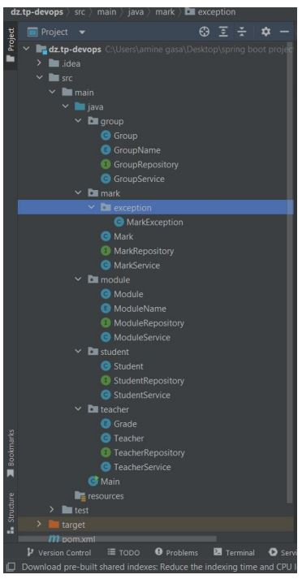
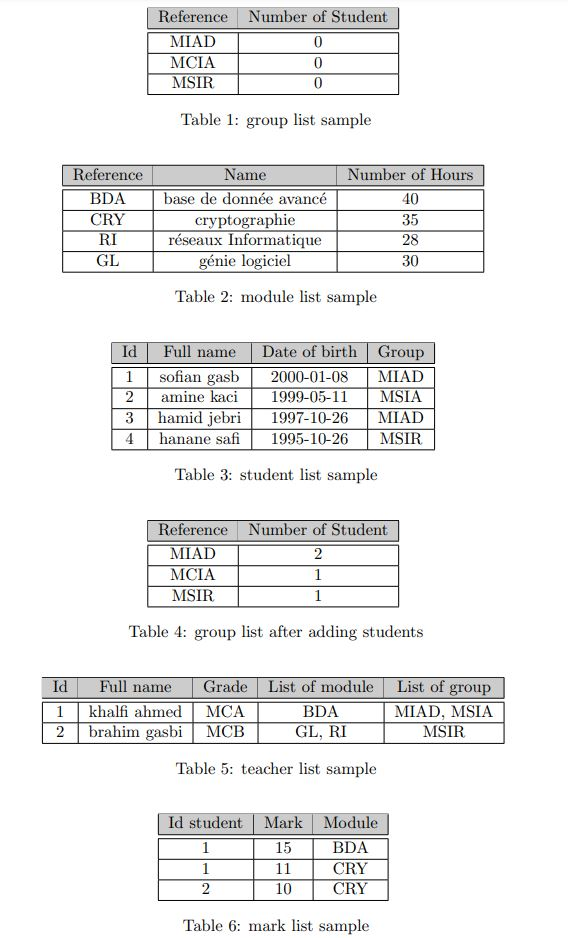

# Testing-Student-Marks-Management-software-with-JUnit-4

## Objectives of this project
- Enhance the knowledge of object-oriented programming
- Best practices to make flexible and maintainable code
- Using Junit 4 to implement unit tests and reach 100% instruction and branch coverage

## Problem Description 
This application is used to manage student marks given by different teachers in a specific module.

each **student** is having the following properties:
- id (auto increment)
- full name of teacher
- date of birth
- group(MSIR, MIAD,...)

each **teacher** is characterized by:
- id (auto increment)
- full name of teacher
- grade (MCA, MCB,...)
- list modules that he/she teaches
- list of the attached group which he/she teaches

each **group** is characterized by:
- reference group
- number of students

each module is characterized by:
- reference
- name
- number of hours

each **mark** is characterized by:
- an integer value between (5-20) which is given by a teacher to a student in a specific module

## Additionally 
1. Each teacher can teach one or more groups
2. Each teacher may teach more than one module
3. Each student is attached to a single group
4. Each mark is related to single student in a specific module

## How the project is organized ?
project consists of 5 different packages.

- package 1 module
- package 2 group
- package 3 student
- package 4 teacher
- package 5 mark
  

## Testing Samples

